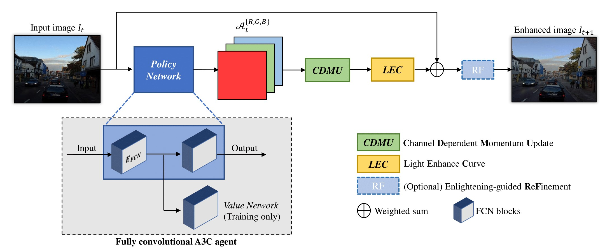

# ReLLIE: Deep Reinforcement Learning for Customized Low-Light Image Enhancement

This repository contains the official implementation of the ACMMM 2021 paper [ReLLIE: Deep Reinforcement Learning for Customized Low-Light Image Enhancement](https://arxiv.org/abs/2107.05830).

## Introduction
To tackle the low-light image enhancement (LLIE) problem, we propose a novel deep reinforcement learning based method, dubbed ReLLIE, for customized low-light enhancement. Specifically,
ReLLIE models LLIE as a markov decision process, i.e., estimating the pixel-wise image-specific curves sequentially and recurrently. Given the reward computed from a set of carefully crafted non-reference loss functions, a lightweight 
network is proposed to estimate the curves for enlightening of a low-light image input. For more details, please refer to our [orginal paper](https://arxiv.org/abs/2107.05830).

<p align=center></p>

## Requirement
* Python 3.5+
* Chainer 5.0+
* Cupy 5.0+
* OpenCV 3.4+
* Torch 1.6

You can install the required libraries by the command `pip install -r requirements.txt`. We checked this code on cuda-10.0 and cudnn-7.3.1.


## Usage
### Training
If you want to train the model
1. `git clone git@github.com:GuoLanqing/ReLLIE.git`
2. download the training data [LOL dataset](https://drive.google.com/file/d/157bjO1_cFuSd0HWDUuAmcHRJDVyWpOxB/view) or your own dataset
3. unzip and put the downloaded "ours485" and "eval15" folders to root folder
```
python train.py
```

### Testing with pretrained models
If you want to test the pretrained model on noisy low-light images (enhancement with denoising)
```
python test.py
```
or on high-quality low-light images (enhancement without denoising)
```
python test_el.py
```

## References
We used the publicly avaliable pretrained models of [FFDNet](https://github.com/cszn/FFDNet) as the denoiser module.

We obtained the LOL and LIME dataset from
* [https://daooshee.github.io/BMVC2018website/](https://daooshee.github.io/BMVC2018website/)
* [https://drive.google.com/file/d/0BwVzAzXoqrSXb3prWUV1YzBjZzg/view?resourcekey=0-VZXvwdwr7QbH3FoX10yPXg](https://drive.google.com/file/d/0BwVzAzXoqrSXb3prWUV1YzBjZzg/view?resourcekey=0-VZXvwdwr7QbH3FoX10yPXg)

Our implementation is based on [PixelRL](https://github.com/rfuruta/pixelRL). We would like to thank them.

Citation
-----
Preprint available [here](https://arxiv.org/abs/2107.05830). 

In case of use, please cite our publication:

R. Zhang, L. Guo, S. Huang and B. Wen, "ReLLIE: Deep Reinforcement Learning for Customized Low-Light Image Enhancement," ACM MM 2021.

Bibtex:
```
@article{zhang2021rellie,
  title={ReLLIE: Deep Reinforcement Learning for Customized Low-Light Image Enhancement},
  author={Zhang, Rongkai and Guo, Lanqing and Huang, Siyu and Wen, Bihan},
  journal={arXiv preprint arXiv:2107.05830},
  year={2021}
}
```


## Contact
If you have any questions, please contact rongkai002@e.ntu.edu.sg or lanqing001@e.ntu.edu.sg
